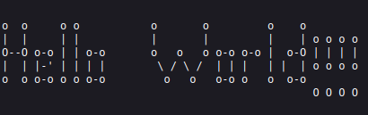

# Ascii-ART-WEB

Ascii-Art-Web is a server that use web GUI of Ascii-Art project

## Authors

@sudo_root  
@ZakirAvrora

## Installation

```bash
git clone git@git.01.alem.school:sudo_root/ascii-art-web.git
```

## Usage

```bash
go run ./api/. --port=8080
```

#### GET localhost:8080/


#### POST localhost:8080/ascii-art


## Implementation

AsciiArt:
```
Initialize the map that stores the pairs of rune and its ascii-art style

Split the input string by newline

FOR string IN strings:
    FOR rune IN string:
        FOR I = 0; I < 8 ; I++:
            PRINT line I of ascii-art style of rune from the map
        END
    END
END
```


